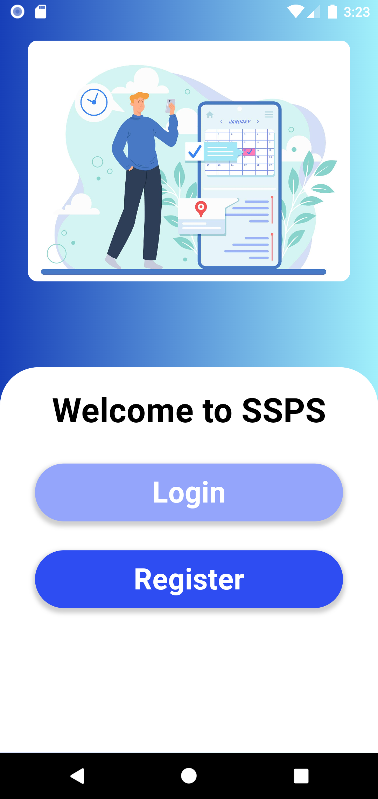
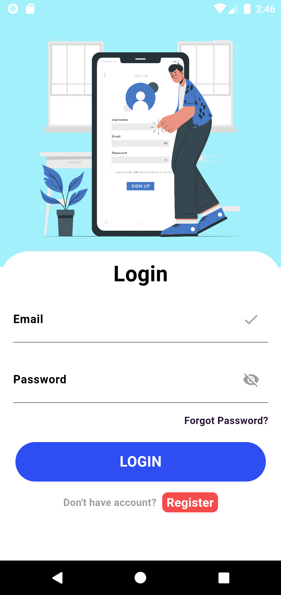
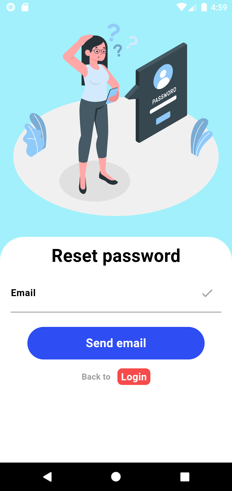
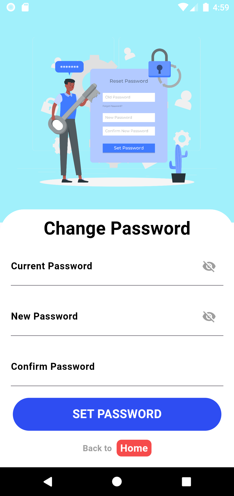
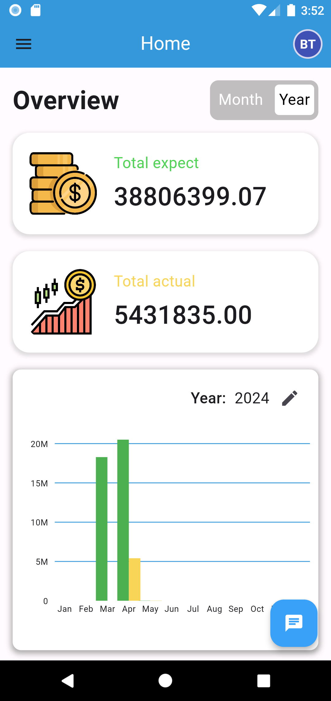
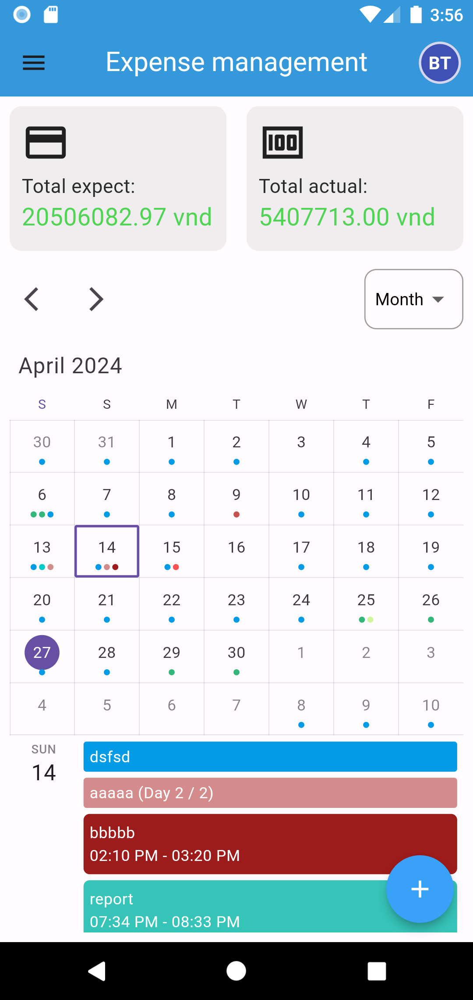
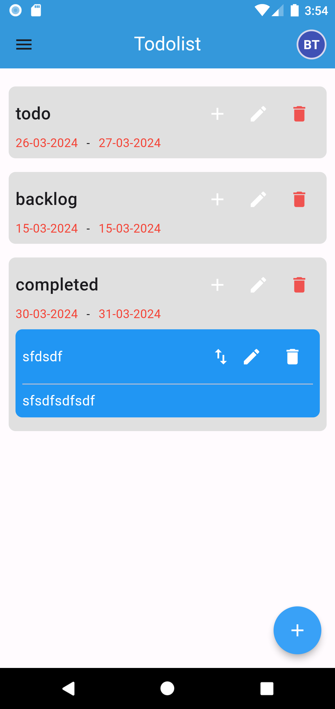
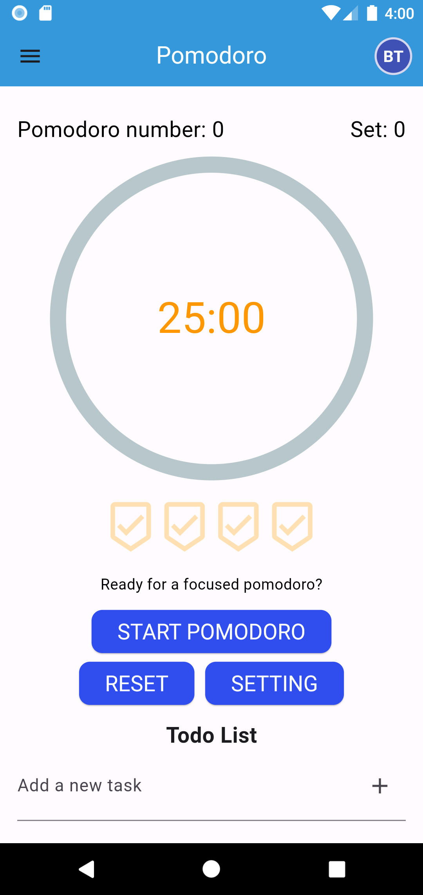
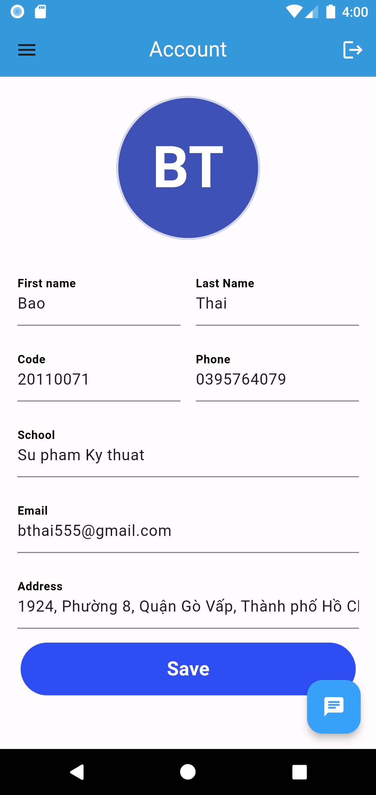

# ssps_app

## How to intsall?

Step 1: Clone the source code from GitHub: SSPS.APP.
Step 2: Open the app source code in Visual Studio Code IDE.
Step 3: Type the command flutter pub get to install necessary packages.
Step 4: After running the flutter pub get command, open the pubspec.yaml file and check the "dependencies" section to ensure that all required packages with their necessary versions are listed.
Step 5: If any of the required packages are missing, type the command flutter pub add package name to add them.
Step 6: Press the shortcut Ctrl + Shift + P and select "Flutter: Select Device" to choose the virtual device to run.
Step 7: Type the command flutter run to start the program.

## App interface

1. Wellcome page

2. Login Page

3. Sign up Page

4. Forgot password

5. Change password

6. Home page

7. Money plan

8. Todo

9. Pomodoro

10. Account
