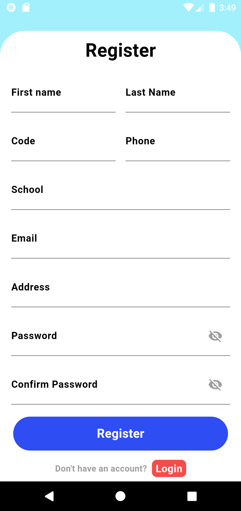

# ssps_app

## How to intsall?

- Step 1: Clone the source code from GitHub: SSPS.APP.
- Step 2: Open the app source code in Visual Studio Code IDE.
- Step 3: Type the command flutter pub get to install necessary packages.
- Step 4: After running the flutter pub get command, open the pubspec.yaml file and check the "dependencies" section to ensure that all required packages with their necessary versions are listed.
- Step 5: If any of the required packages are missing, type the command flutter pub add package name to add them.
- Step 6: Press the shortcut Ctrl + Shift + P and select "Flutter: Select Device" to choose the virtual device to run.
- Step 7: Type the command flutter run to start the program.

## App interface

<<<<<<< HEAD
1. Wellcome page: The page is displayed for beginners to use the app
   
2. Login Page: Users enter their account and password to use the app
   
3. Sign up Page: If the user does not have an account, they will provide information and proceed to create an account
   
4. Forgot password: Users forget their password, enter email for the system to confirm sending otp and change password
   
5. Change password: User wants to change current password
   
6. Home page: Spending plan statistics page by month and year
   
7. Money plan: The interface displays detailed information of the spending plan by day, week, month and notes of the day
   
8. Todo: Display tasks that need to be done by specific time
   
9. Pomodoro: The timer helps users focus on completing tasks within a certain amount of time
   
10. Account: User information editing page
    
=======
1. Wellcome page

2. Login Page

3. Sign up Page

4. Forgot password

5. Change password

6. Home page

7. Money plan

8. Todo

9. Pomodoro

10. Account

>>>>>>> 0ef11a49319797c1991e3a655495ce8e47e9d317
